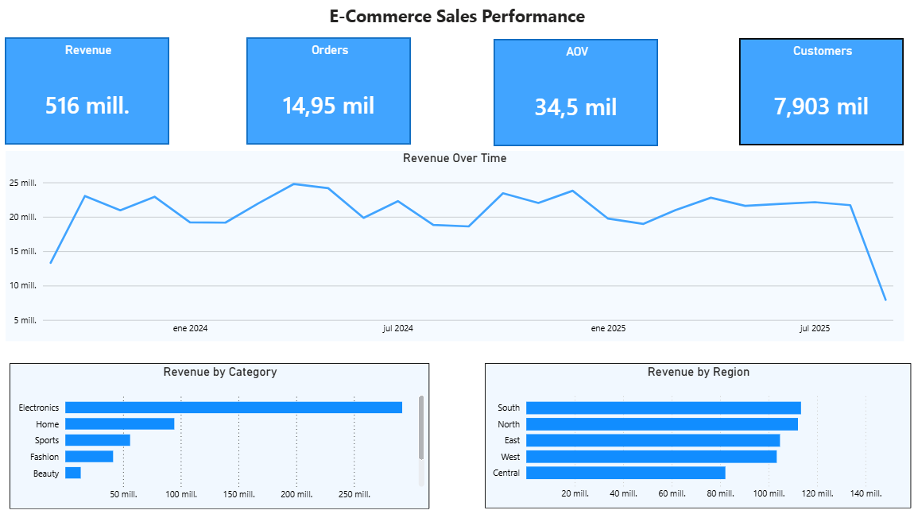

# Sales Performance Analysis

## Overview

This project analyzes transactional sales data to understand what drives revenue across products, categories, regions, and customers.

The goal was to turn raw sales data into clear business insights using Python for data preparation, SQL and SQLite for analysis, and Power BI for visualization.

## Business Question

**Where is revenue coming from, which areas have the greatest impact on sales, and how does performance change over time?**

## Tools

* Python
* Pandas
* SQL
* SQLite
* Power BI

## Dataset

The dataset contains transactional sales data covering orders, customers, products, pricing, discounts, and regional information.

Key fields include:

* Order ID
* Order Date
* Customer ID
* Product ID
* Category
* Region
* Quantity
* Price
* Discount
* Shipping Cost
* Total Amount
* Returned

The original dataset is stored in `data/raw/dataset.csv`.

## What I Analyzed

The analysis focused on the main drivers of sales performance:

* Total revenue, orders, customers, and Average Order Value (AOV)
* Revenue by category
* Revenue by region
* Monthly revenue trends
* Top products by revenue
* Top customers by revenue

Python was used to clean and transform the data before loading it into SQLite. SQL was then used to structure the business analysis, with the results presented through an interactive Power BI dashboard.

## Key Insights

* The business generated **$5.87M in revenue** across **34,500 orders and 7,903 customers**, with an overall **AOV of $170.01**.
* **Electronics is the main revenue driver**, accounting for approximately **56.6% of total revenue**.
* **South leads regional performance** with approximately **$1.30M in revenue**, although revenue is relatively balanced across regions.
* Monthly revenue shows clear fluctuations, with **December 2024 reaching the highest monthly revenue at approximately $278K**.
* The highest-value customers have AOVs well above the overall $170.01 benchmark, highlighting a group of customers with significantly higher purchasing value.
* The top revenue-generating products are all part of **Electronics**, reinforcing the category's importance to overall sales performance.

## Executive Summary

The analysis shows that revenue performance is driven primarily by a small number of key areas.

**Electronics stands out as the strongest category**, generating more than half of total revenue. This makes it an important area to monitor when evaluating product mix and commercial performance.

Customer analysis also highlights a group of high-value customers with significantly higher AOVs than the overall business. Understanding these customers can help inform retention and customer value strategies.

Regional performance is more evenly distributed, with South ranking first but without a dominant share of total revenue. Meanwhile, monthly trends show meaningful variation throughout the period, providing a useful basis for monitoring sales performance and potential seasonality.

From a business perspective, the findings can support decisions around:

* Product and category prioritization
* High-value customer retention
* Regional performance monitoring
* Sales planning and performance tracking

Overall, the project demonstrates how transactional data can be turned into practical business insights through a structured **Python → SQL → Power BI** workflow.

## Files

* `main.py` → data cleaning, transformation, and database creation
* `run_sql.py` → SQL query execution
* `data/raw/dataset.csv` → original dataset
* `data/processed/sales_processed.csv` → processed dataset
* `database/sales.db` → SQLite database
* `sql/queries.sql` → business analysis queries
* `images/dashboard_screenshot.png` → Power BI dashboard preview
* `README.md` → project documentation

## Visualizations

### Power BI Dashboard

The dashboard provides a concise view of overall sales performance, including:

* Total Revenue
* Total Orders
* Average Order Value (AOV)
* Total Customers
* Revenue Over Time
* Revenue by Category
* Revenue by Region

## Next Steps

Potential next steps include:

* Add profit margin analysis
* Analyze returned orders in more detail
* Add customer segmentation
* Compare revenue and units sold
* Expand product-level performance analysis
* Add additional commercial KPIs to the Power BI dashboard
* Explore sales forecasting
